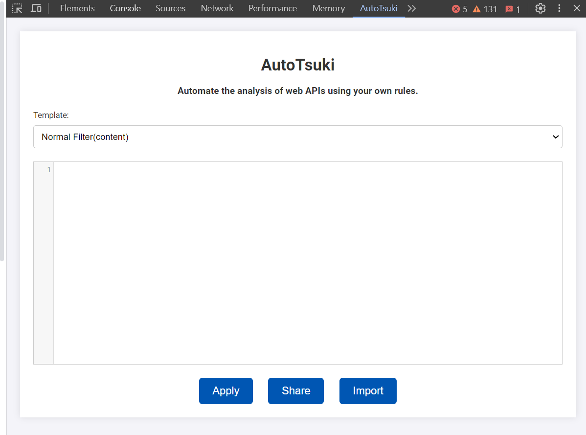

# AutoTsuki - Automate the analysis of web APIs using your own rules.

### Automated & Insightful Analysis

- The initiative behind our project is to provide a groundbreaking approach for developers and analysts to automate the analysis of web APIs used by web pages. Through crafting their own rules, users can accurately identify how data on a webpage is retrieved via specific APIs. This process is anticipated to be fully automated, leveraging a Chrome extension for implementation.
- Leveraging this framework, we aim to incorporate a suite of tools as part of our analysis interface, enabling these tools to share critical insights with one another. This facilitates a dynamic interaction with the analytical outputs, allowing users to conduct innovative and creative investigations.

### Comprehensive Analysis Spectrum

- Our framework doesn't limit itself to static analysis alone but ambitiously encompasses dynamic analysis tools as well. This dual approach ensures a thorough examination of web pages, from code inspection to runtime behavior analysis.
- Customizable & Collaborative
  By designing a system where users can craft scripts tailored to specific analytical scenarios, we promote a culture of reusability and collaboration. These scripts, once created, are not just applicable to a variety of targets but can also be shared amongst the community, fostering a rich exchange of knowledge and techniques.

## Quick Start


The first step is to download the extension.
```bash
git clone https://github.com/quark-engine/tsuki.git
```

The second step, please visit chrome://extensions, and click on "Load unpacked", then select the folder you just downloaded.

Finally, you can open the Developer Tools, and you will find a new tab called "AutoTsuki", indicating that the installation was successful.



## Documents

TODO

## TODOList

- [ ] Make console just log on frontend preference.
- [ ] Fix cliperboard functions in Share.
- [ ] Fulfill the UI/UX.
- [ ] Refactor all function.
